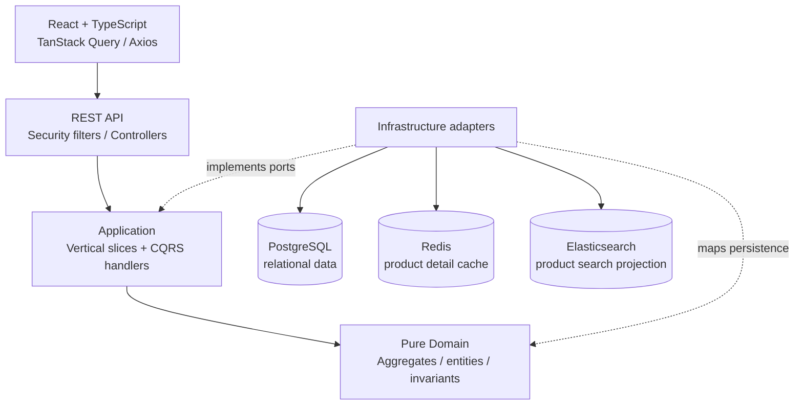
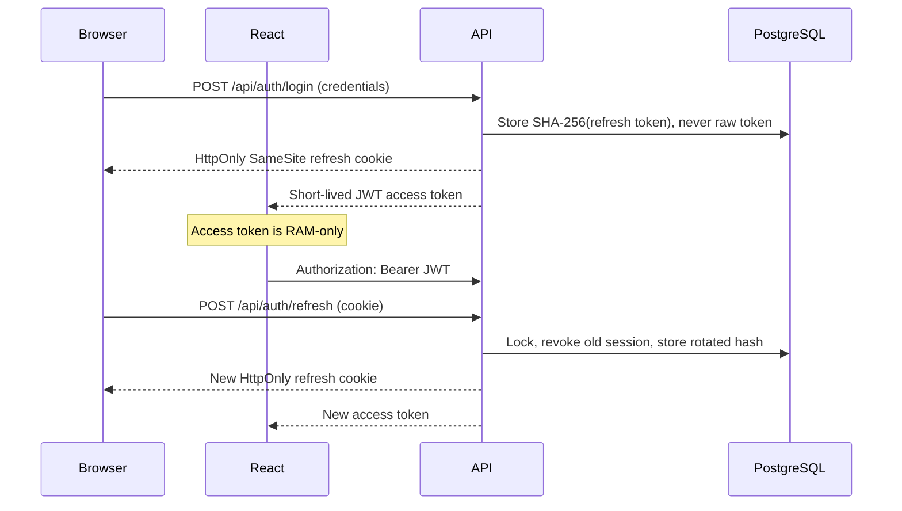

# RetailHub

RetailHub is a production-oriented portfolio application for retail catalog,
inventory, and order operations. It is a Java 21/Spring Boot modular monolith with
a React/TypeScript client. The implementation follows the repository's original
technical design: Clean Architecture, application-level vertical slices and CQRS,
DDD domain models, relational JPA persistence for orders, Result-based application
failures, Redis cache-aside reads, Elasticsearch product search, and rotating
refresh-token sessions.

## Architecture



The backend dependency direction is `API → Application → Domain`. Domain classes
have no Spring, JPA, HTTP, Redis, or Elasticsearch dependencies. Infrastructure
contains persistence entities and adapter implementations. Application features are
organized by use case rather than generic service/DTO directories.

### Modules

- **Identity** — registration, BCrypt passwords, JWT access tokens, rotating refresh
  sessions, logout, logout-all, and current-user queries.
- **Catalog** — category management, product create/update/deactivate, pageable
  filtering, Redis product detail caching, and Elasticsearch search/reindex.
- **Inventory** — current stock reads, ADMIN-only manual adjustments, pageable
  movement audit history, and Hibernate `@Version` optimistic locking.
- **Ordering** — a DDD `Order` aggregate persisted in relational `orders` and
  `order_items` tables, command/query separation, and JPA optimistic locking.

## Ordering persistence and application failures

Order command handlers load and mutate the `Order` aggregate through an
`OrderRepository`, then persist it with Hibernate. Queries remain logically separate
and use direct relational DTO projections; there is no event replay, event store, or
duplicate order read table. The `orders.version` column is managed by JPA `@Version`,
and expected concurrent changes return a `CONFLICT` Result that maps to HTTP 409.

All CQRS handlers return a small framework-independent `Result<T>`. Expected
validation, not-found, authorization, conflict, and business-rule failures are
represented by stable application error codes and mapped to the existing API problem
shape at the controller boundary. Unexpected infrastructure failures still propagate
to the global exception handler.

## Authentication and token storage



The React access token store is module memory only—there is no `localStorage`,
`sessionStorage`, IndexedDB, or persistence middleware. Browser reload calls the
refresh endpoint. Axios uses one shared refresh promise, so concurrent 401 responses
cause one rotation request and then retry waiting requests. A failed refresh clears
the local auth state. Production deployments must set `COOKIE_SECURE=true` and use
HTTPS.

## Technology stack

- Java 21, Spring Boot 4.1, Spring Web MVC, Spring Security, Validation
- Spring Data JPA/Hibernate, Flyway, PostgreSQL 17
- Spring Data Redis/Redis 8, Spring Data Elasticsearch/Elasticsearch 9
- MapStruct, Jackson, Springdoc OpenAPI
- React 19, TypeScript 7, Vite 8, React Router 7
- TanStack Query, Axios, React Hook Form, Zod, Phosphor icons
- JUnit 5, Mockito, AssertJ, Spring Boot Test, Testcontainers, Vitest, Testing Library
- Docker Compose and GitHub Actions

## Repository structure

```text
.
├── backend/
│   └── src/main/java/com/johnvo/retailhub/
│       ├── api/
│       ├── application/features/
│       ├── domain/
│       └── infrastructure/
├── frontend/
│   ├── src/
│   │   ├── app/
│   │   ├── components/
│   │   ├── features/
│   │   ├── lib/
│   │   └── types/
│   └── tests/
│       ├── unit/
│       ├── integration/
│       └── setup/
├── design-system/
├── scripts/
│   ├── deploy.ps1
│   └── rollback.ps1
├── .github/workflows/
│   ├── ci.yml
│   └── deploy.yml
├── docker-compose.yml
├── docker-compose.prod.yml
├── .env.example
├── .env.production.example
└── README.md
```

## Requirements

- Docker Desktop/Engine with Compose v2 (recommended full setup)
- For host development: Java 21 and Node.js 24+
- Approximately 2 GB free memory for PostgreSQL, Redis, Elasticsearch, and the apps

## Start the complete system with Docker

```powershell
Copy-Item .env.example .env
docker compose up --build -d
docker compose ps
```

Open:

- Frontend: <http://localhost:5173>
- Backend health: <http://localhost:8080/api/health>
- Swagger UI (development): <http://localhost:8080/swagger-ui.html>
- OpenAPI JSON: <http://localhost:8080/v3/api-docs>
- Elasticsearch: <http://localhost:9200>

The example environment creates a development administrator only when
`ADMIN_EMAIL` and `ADMIN_PASSWORD` are non-empty. The sample values are
`admin@retailhub.local` / `RetailHub123!`; replace them before any shared deployment.
Newly registered accounts receive the `USER` role.

Stop without removing data:

```powershell
docker compose down
```

To intentionally remove the project's named database/cache/index volumes as well:

```powershell
docker compose down --volumes
```

## CI/CD and production deployment

Pull requests and pushes to `main` run `.github/workflows/ci.yml`: Maven `verify`,
frontend tests, and the frontend production build. Pull requests never deploy.
After CI succeeds for a `main` push, `.github/workflows/deploy.yml` builds the backend
and frontend with BuildKit caching and pushes only immutable commit-SHA tags to GHCR:

```text
ghcr.io/johnvo402/retail-hub-backend:<40-character-git-sha>
ghcr.io/johnvo402/retail-hub-frontend:<40-character-git-sha>
```

The deploy job runs on the production Windows machine through a self-hosted GitHub
Actions runner. This matches the existing PowerShell-based production operation,
does not require inbound SSH, and keeps `.env.production` on the server. The job is
serialized by the `retailhub-production` concurrency group and skips a commit if a
newer `main` commit has already superseded it.

Production Compose pulls the exact SHA images; it never builds application source on
the server. Only the frontend port is published. Nginx proxies `/api` to the backend
on the private Docker network, and PostgreSQL, Redis, Elasticsearch, and the backend
have no host port mappings. Local development remains unchanged and continues to use
`docker-compose.yml` with local image builds.

### One-time production setup

The production server requires Docker Engine or Docker Desktop with Compose v2, Git,
and a GitHub Actions self-hosted runner running under an account allowed to use
Docker. Register that runner for this repository with the standard `self-hosted`,
`Windows`, and `X64` labels plus a custom `production` label.

Create the GitHub Environment `production`. It does not need approval unless desired.
Add one environment variable (not a secret) named `PRODUCTION_ENV_FILE` containing an
absolute server path outside the runner checkout, for example
`C:\retailhub\config\.env.production`. Keeping it outside the checkout prevents
`actions/checkout` cleanup from deleting it.

On the server, copy `.env.production.example` to that path and set at least:

- `POSTGRES_PASSWORD`: a strong unique database password
- `JWT_ACCESS_SECRET`: a random value of at least 32 characters
- `PUBLIC_ORIGIN`: the externally reachable HTTPS origin
- optional `ADMIN_EMAIL` and `ADMIN_PASSWORD` only for initial administrator bootstrap

Do not add this file to Git. Repository secrets are not required for GHCR: the
workflow uses the scoped built-in `GITHUB_TOKEN` with `packages: write` only while
building and `packages: read` while deploying. If GHCR packages are private, ensure
the repository and runner job have access to those packages.

### First and future deployments

Push or merge to `main`. CI must pass before images are built. The deployment runner
then logs in to GHCR, pulls both images for that exact commit, and executes:

```powershell
.\scripts\deploy.ps1 `
  -Sha <40-character-git-sha> `
  -EnvFile C:\retailhub\config\.env.production
```

The script validates Compose configuration, runs `docker compose pull`, and uses
`docker compose up -d` without a preceding `down`. Unchanged infrastructure is not
recreated, and the named `postgres_data`, `redis_data`, and `elasticsearch_data`
volumes remain attached. Flyway continues to run during backend startup before
readiness succeeds. The script waits for every container health check and then checks
`<PUBLIC_ORIGIN>/api/health` through the public frontend path.

For a manual deployment, check out the desired repository revision, authenticate the
server to GHCR using a credential with package read access, and run the same command.
Never use a mutable `latest` tag as a deployment identity.

Inspect a deployment without printing environment values:

```powershell
docker compose --env-file C:\retailhub\config\.env.production -f docker-compose.prod.yml ps
docker compose --env-file C:\retailhub\config\.env.production -f docker-compose.prod.yml logs --tail 100 backend frontend
Invoke-WebRequest https://retailhub.example.com/api/health -UseBasicParsing
```

### Failed deployment and rollback

If application or public health checks fail, `deploy.ps1` prints container status and
at most 100 recent backend/frontend log lines, restores the image references captured
before deployment, runs Compose again, and verifies rollback health. The workflow
still exits as failed so GitHub records the unsuccessful release. On the very first
deployment there are no prior application containers to restore.

To roll back deliberately, select a previously successful commit SHA from the GHCR
package or Git history and run:

```powershell
.\scripts\rollback.ps1 `
  -Sha <previous-successful-40-character-git-sha> `
  -EnvFile C:\retailhub\config\.env.production
```

Rollback pulls and deploys both artifacts from the same commit, then performs the
same readiness and public health checks. Normal deployment and rollback never run
`docker compose down -v`, delete named volumes, reset PostgreSQL, or invoke Flyway
clean. HTTPS termination remains required because production authentication cookies
default to `Secure`.

## Run infrastructure in Docker and apps on the host

```powershell
docker compose up -d postgres redis elasticsearch

Set-Location backend
.\mvnw.cmd spring-boot:run

# In another terminal
Set-Location frontend
npm ci
npm run dev
```

The application defaults already target `localhost:5432`, `localhost:6379`, and
`localhost:9200`. PostgreSQL defaults are database/user/password
`retailhub` / `retailhub` / `retailhub_dev`. Set the environment variables from
`.env.example` when different values are required.

## Database migrations

Flyway runs automatically before Hibernate validation. Hibernate uses
`ddl-auto=validate`; it never creates the application schema. Migrations are in
`backend/src/main/resources/db/migration`:

1. users
2. categories and products
3. inventory with non-negative stock check
4. historical JSONB order event store (removed by migration 7)
5. historical order read models (migrated and removed by migration 7)
6. hashed refresh sessions
7. relational orders/order items, projection data migration, and event-table cleanup
8. immutable inventory movement audit records and product/time query index

Run migrations by starting the backend, or package/start it with:

```powershell
Set-Location backend
.\mvnw.cmd package
java -jar target\retailhub-1.0.0-SNAPSHOT.jar
```

## Tests and verification

Backend unit and integration tests (integration tests use PostgreSQL, Redis, and
Elasticsearch Testcontainers, so Docker must be running):

```powershell
Set-Location backend
.\mvnw.cmd test
```

Frontend:

```powershell
Set-Location frontend
npm ci
npm test
npm run build
```

Compose syntax and resolved configuration:

```powershell
docker compose config --quiet
```

Tests cover order and inventory invariants, atomic inventory movement auditing,
Result-based application handlers,
refresh rotation, old-token rejection, cookie attributes, logout revocation,
protected endpoints, Flyway/JPA mappings, Redis population/invalidation,
Elasticsearch indexing/search, relational order round trips, query projections, and
JPA optimistic concurrency.

## API overview

| Area       | Endpoints                                                                                     |
| ---------- | --------------------------------------------------------------------------------------------- |
| Auth       | `/api/auth/register`, `login`, `refresh`, `logout`, `logout-all`, `me`                        |
| Products   | `/api/products`, `/api/products/{id}`, `/api/products/search`, `/api/products/search/reindex` |
| Categories | `/api/categories`, `/api/categories/{id}`                                                     |
| Inventory  | `/api/inventory`, `/api/inventory/{productId}`, `movements`, `increase`, `decrease`           |
| Orders     | `/api/orders`, `/api/orders/{id}`, item add/remove, `confirm`, `cancel`                       |
| Dashboard  | `/api/dashboard/overview`                                                                     |

Product/category writes and manual inventory adjustments require `ADMIN`; catalog
reads are public; inventory reads and orders require a JWT. Errors use one Problem Details-style shape with type, title,
status, detail, optional field errors, and a trace ID. Swagger is enabled by default
for development and disabled by `application-prod.yml`.

The authenticated dashboard overview uses database aggregates rather than paginated
API pages. Catalog and inventory metrics are global; order counts, confirmed order
value, and recent orders are customer-scoped for `USER` and global for `ADMIN`.
Low stock means `quantity < 5`, while the preview returns at most six rows.

## Environment variables

See [`.env.example`](.env.example). Required non-local values include database
credentials and a random `JWT_ACCESS_SECRET` of at least 32 bytes. Access/refresh
lifetimes are seconds. Cookie security, SameSite, optional domain, the exact CORS
origin, product cache TTL, and optional initial administrator are configurable.

## Important decisions and assumptions

- Product deletion is soft deactivation, preserving inventory/order references.
- Category deletion is also deactivation; renaming/deactivation triggers a search
  rebuild so indexed category text remains accurate.
- Creating a product creates a zero-quantity inventory row.
- Order item price/name/SKU snapshots come from the server-side product aggregate;
  clients cannot submit their own price.
- Order confirmation atomically deducts inventory for every order item. Insufficient
  stock prevents confirmation and leaves both inventory and the order unchanged;
  stock is not reserved before confirmation.
- Manual stock changes record the authenticated actor, while order confirmation
  creates automatic stock-out movements linked to the order. Stock mutation and its
  movement records share one database transaction, so neither can commit alone.
- `inventory_items.quantity` remains the authoritative stock state.
  `inventory_movements` is an immutable audit history and is **not Event Sourcing**.
- Search/cache projections update synchronously. PostgreSQL remains their source of
  truth, and the admin reindex endpoint can rebuild Elasticsearch.
- True cross-site cookie deployments require an explicit CSRF strategy and an
  appropriate SameSite policy; the shipped same-site topology uses Strict by default.
