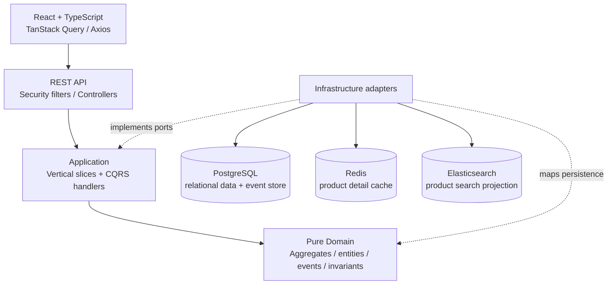
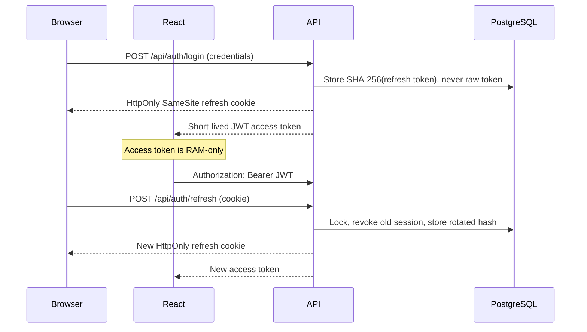

# RetailHub

RetailHub is a production-oriented portfolio application for retail catalog,
inventory, and order operations. It is a Java 21/Spring Boot modular monolith with
a React/TypeScript client. The implementation follows the repository's original
technical design: Clean Architecture, application-level vertical slices and CQRS,
DDD domain models, PostgreSQL-backed Event Sourcing for orders, Redis cache-aside
reads, Elasticsearch product search, and rotating refresh-token sessions.

## Architecture



The backend dependency direction is `API → Application → Domain`. Domain classes
have no Spring, JPA, HTTP, Redis, or Elasticsearch dependencies. Infrastructure
contains persistence entities and adapter implementations. Application features are
organized by use case rather than generic service/DTO directories.

### Modules

- **Identity** — registration, BCrypt passwords, JWT access tokens, rotating refresh
  sessions, logout, logout-all, and current-user queries.
- **Catalog** — category management, product create/update/deactivate, pageable
  filtering, Redis product detail caching, and Elasticsearch search/reindex.
- **Inventory** — stock reads and positive adjustments with a database check and
  Hibernate `@Version` optimistic locking.
- **Ordering** — an event-sourced `Order` aggregate, PostgreSQL event store,
  optimistic stream versions, and synchronous relational read-model projection.

## Order Event Sourcing

Only orders are event sourced. Each aggregate stream stores `OrderCreated`,
`OrderItemAdded`, `OrderItemRemoved`, `OrderConfirmed`, and `OrderCancelled` in
`domain_events`. `(aggregate_id, version)` is unique, so concurrent appends return
HTTP `409 Conflict`. Command handlers rehydrate an aggregate before applying a
business operation. GET endpoints never replay streams; they query
`order_read_models` and `order_item_read_models`.

## Authentication and token storage



The React access token store is module memory only—there is no `localStorage`,
`sessionStorage`, IndexedDB, or persistence middleware. Browser reload calls the
refresh endpoint. Axios uses one shared refresh promise, so concurrent 401 responses
cause one rotation request and then retry waiting requests. A failed refresh clears
the local auth state. Production deployments must set `COOKIE_SECURE=true` and use
HTTPS.

## Technology stack

- Java 21, Spring Boot 4.1, Spring Web MVC, Spring Security, Validation
- Spring Data JPA/Hibernate, Flyway, PostgreSQL 17
- Spring Data Redis/Redis 8, Spring Data Elasticsearch/Elasticsearch 9
- MapStruct, Jackson, Springdoc OpenAPI
- React 19, TypeScript 7, Vite 8, React Router 7
- TanStack Query, Axios, React Hook Form, Zod, Phosphor icons
- JUnit 5, Mockito, AssertJ, Spring Boot Test, Testcontainers, Vitest, Testing Library
- Docker Compose and GitHub Actions

## Repository structure

```text
.
├── backend/
│   └── src/main/java/com/johnvo/retailhub/
│       ├── api/
│       ├── application/features/
│       ├── domain/
│       └── infrastructure/
├── frontend/
│   └── src/
│       ├── app/
│       ├── components/
│       ├── features/
│       ├── lib/
│       └── types/
├── design-system/
├── docker-compose.yml
├── .env.example
└── README.md
```

## Requirements

- Docker Desktop/Engine with Compose v2 (recommended full setup)
- For host development: Java 21 and Node.js 24+
- Approximately 2 GB free memory for PostgreSQL, Redis, Elasticsearch, and the apps

## Start the complete system with Docker

```powershell
Copy-Item .env.example .env
docker compose up --build -d
docker compose ps
```

Open:

- Frontend: <http://localhost:5173>
- Backend health: <http://localhost:8080/api/health>
- Swagger UI (development): <http://localhost:8080/swagger-ui.html>
- OpenAPI JSON: <http://localhost:8080/v3/api-docs>
- Elasticsearch: <http://localhost:9200>

The example environment creates a development administrator only when
`ADMIN_EMAIL` and `ADMIN_PASSWORD` are non-empty. The sample values are
`admin@retailhub.local` / `RetailHub123!`; replace them before any shared deployment.
Newly registered accounts receive the `USER` role.

Stop without removing data:

```powershell
docker compose down
```

To intentionally remove the project's named database/cache/index volumes as well:

```powershell
docker compose down --volumes
```

## Run infrastructure in Docker and apps on the host

```powershell
docker compose up -d postgres redis elasticsearch

Set-Location backend
.\mvnw.cmd spring-boot:run

# In another terminal
Set-Location frontend
npm ci
npm run dev
```

The application defaults already target `localhost:5432`, `localhost:6379`, and
`localhost:9200`. PostgreSQL defaults are database/user/password
`retailhub` / `retailhub` / `retailhub_dev`. Set the environment variables from
`.env.example` when different values are required.

## Database migrations

Flyway runs automatically before Hibernate validation. Hibernate uses
`ddl-auto=validate`; it never creates the application schema. Migrations are in
`backend/src/main/resources/db/migration`:

1. users
2. categories and products
3. inventory with non-negative stock check
4. JSONB domain event store and unique stream versions
5. order read models
6. hashed refresh sessions

Run migrations by starting the backend, or package/start it with:

```powershell
Set-Location backend
.\mvnw.cmd package
java -jar target\retailhub-1.0.0-SNAPSHOT.jar
```

## Tests and verification

Backend unit and integration tests (integration tests use PostgreSQL, Redis, and
Elasticsearch Testcontainers, so Docker must be running):

```powershell
Set-Location backend
.\mvnw.cmd test
```

Frontend:

```powershell
Set-Location frontend
npm ci
npm test
npm run build
```

Compose syntax and resolved configuration:

```powershell
docker compose config --quiet
```

Tests cover order and inventory invariants, application handlers, refresh rotation,
old-token rejection, cookie attributes, logout revocation, protected endpoints,
Flyway/JPA mappings, Redis population/invalidation, Elasticsearch indexing/search,
event persistence/concurrency, and order projection correctness.

## API overview

| Area       | Endpoints                                                                                     |
| ---------- | --------------------------------------------------------------------------------------------- |
| Auth       | `/api/auth/register`, `login`, `refresh`, `logout`, `logout-all`, `me`                        |
| Products   | `/api/products`, `/api/products/{id}`, `/api/products/search`, `/api/products/search/reindex` |
| Categories | `/api/categories`, `/api/categories/{id}`                                                     |
| Inventory  | `/api/inventory`, `/api/inventory/{productId}`, `increase`, `decrease`                        |
| Orders     | `/api/orders`, `/api/orders/{id}`, item add/remove, `confirm`, `cancel`                       |

Product/category writes require `ADMIN`; catalog reads are public; inventory and
orders require a JWT. Errors use one Problem Details-style shape with type, title,
status, detail, optional field errors, and a trace ID. Swagger is enabled by default
for development and disabled by `application-prod.yml`.

## Environment variables

See [`.env.example`](.env.example). Required non-local values include database
credentials and a random `JWT_ACCESS_SECRET` of at least 32 bytes. Access/refresh
lifetimes are seconds. Cookie security, SameSite, optional domain, the exact CORS
origin, product cache TTL, and optional initial administrator are configurable.

## Important decisions and assumptions

- Product deletion is soft deactivation, preserving inventory/order references.
- Category deletion is also deactivation; renaming/deactivation triggers a search
  rebuild so indexed category text remains accurate.
- Creating a product creates a zero-quantity inventory row.
- Order item price/name/SKU snapshots come from the server-side product aggregate;
  clients cannot submit their own price.
- Order confirmation does not automatically decrement inventory because the source
  design defines these workflows independently and does not specify reservation or
  fulfillment semantics.
- Search/cache projections update synchronously. PostgreSQL remains their source of
  truth, and the admin reindex endpoint can rebuild Elasticsearch.
- True cross-site cookie deployments require an explicit CSRF strategy and an
  appropriate SameSite policy; the shipped same-site topology uses Strict by default.
